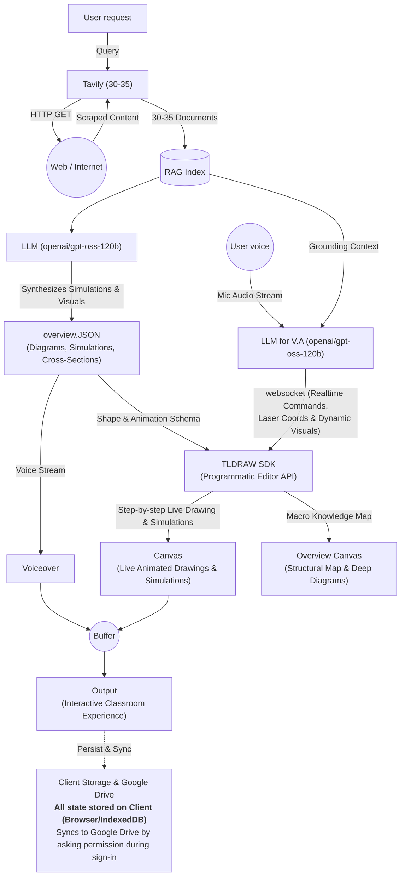
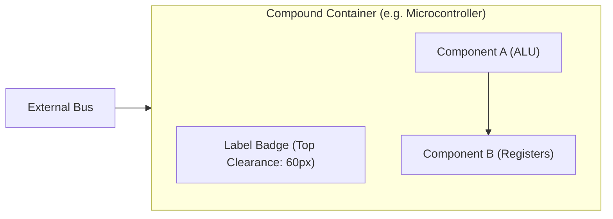
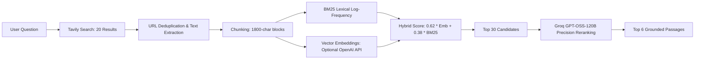
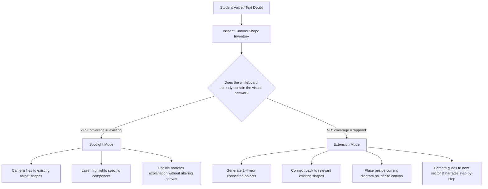
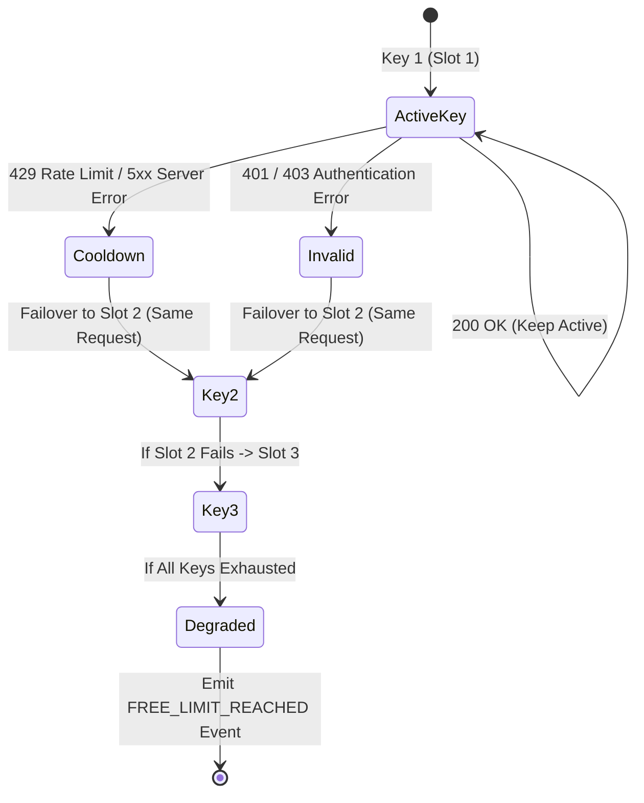

<p align="center">
  
</p>

<h1 align="center">Chalkie: The Visual-First AI Whiteboard Teacher</h1>

<p align="center">
  <strong>An intelligent, multimodal whiteboard teacher that researches questions, synthesizes structured semantic diagrams, and delivers live, narrated visual lessons on an infinite canvas with synchronized camera panning and laser pointer tracking.</strong>
</p>

<p align="center">
  
  
  
  
  
  
  
</p>

---

## 📖 Table of Contents

- [Overview](#-overview)
- [System Architecture](#-system-architecture)
- [Key Features & Capabilities](#-key-features--capabilities)
- [Visual Grammar & Spatial Layout](#-visual-grammar--spatial-layout)
  - [12-Stage Geometric Normalization](#12-stage-geometric-normalization)
  - [Hierarchical Compound Containers (ELK.js)](#hierarchical-compound-containers-elkjs)
  - [Parametric Scientific & Technical Primitives](#parametric-scientific--technical-primitives)
  - [WCAG 2.1 Dynamic Luminance & Color System](#wcag-21-dynamic-luminance--color-system)
- [Custom tldraw Shapes & Templates](#-custom-tldraw-shapes--templates)
- [Voice & Narration Pipeline](#-voice--narration-pipeline)
  - [Phonetic Formatting & Unit Expansion](#phonetic-formatting--unit-expansion)
  - [Neural Voice Scoring & Auto-Selection](#neural-voice-scoring--auto-selection)
  - [Synchronized Audio & Laser Drawing](#synchronized-audio--laser-drawing)
- [Hybrid RAG & Research Pipeline](#-hybrid-rag--research-pipeline)
- [Conversational Follow-Ups: Revisit vs. Append](#-conversational-follow-ups-revisit-vs-append)
- [BYOK Security & Sticky Key Failover Pool](#-byok-security--sticky-key-failover-pool)
- [Realtime Dual-Transport Architecture](#-realtime-dual-transport-architecture)
- [Client Storage & Cloud Backup](#-client-storage--cloud-backup)
- [Directory Structure](#-directory-structure)
- [API Route Reference](#-api-route-reference)
- [Environment Variables](#-environment-variables)
- [Getting Started](#-getting-started)
- [Testing & Quality Verification](#-testing--quality-verification)
- [Production Deployment](#-production-deployment)

---

## 💡 Overview

Most AI learning tools produce dense walls of markdown text or simplistic flowcharts consisting of generic boxes with arrows. **Chalkie operates on a fundamentally different pedagogical paradigm: real-time visual-spatial teaching.**

When a learner asks a conceptual question by text or voice:
1. **Live Autonomous Research:** Chalkie retrieves up to 20 web sources via Tavily, constructs an indexed in-memory or Redis-backed knowledge store, and calculates hybrid lexical (BM25) and semantic vector relevance.
2. **Semantic Scene Graph Generation:** Groq Cloud’s `openai/gpt-oss-120b` generates a strict, validated visual lesson schema. The model never emits raw code or coordinate guessing; it defines physical entities, structural mechanisms, forces, and mathematical equations.
3. **Mathematical Spatial Layout:** The abstract schema passes through dual layout engines (**Eclipse Layout Kernel / ELK.js** and **Dagre**) to eliminate bounding-box collisions, align compound parents with their children, enforce clear margins, and calculate clean routing anchors.
4. **Live Whiteboard Narration:** On a customized **tldraw v5.4** canvas, Chalkie progressively draws the diagram step-by-step in sync with voice narration (Groq Whisper + Orpheus or browser Web Speech). The camera smoothly glides across the infinite canvas while a glowing laser pointer spotlights the exact physical parts being explained.
5. **Context-Aware Follow-ups:** Learners can ask voice follow-up questions. Chalkie decides whether the answer already exists on the canvas (flying the camera to revisit and highlight existing shapes) or represents a new concept (appending a connected diagram extension beside the original).

---

## 🏛️ System Architecture



### Architectural Pipeline Breakdown

The architecture follows a dual-engine loop uniting live web research, deep LLM diagram synthesis, and a real-time voice assistant:

1. **User Request & Autonomous Web Scraping (`Tavily 30-35` $\leftrightarrow$ `Web / Internet`):**
   - The learner submits an inquiry via text or voice.
   - Tavily queries the web, scraping 30–35 rich documents and markdown extracts (`HTTP GET` / `Scraped Content`).
   - Content is chunked into 1800-character segments with 250-character semantic overlaps and ingested into the session's **RAG Index** (in-memory or Redis-backed).

2. **Dual `openai/gpt-oss-120b` Model Execution:**
   - **Primary Synthesis Engine (`LLM`):** Grounded in the `RAG Index`, this instance synthesizes real physical simulations, mechanistic cutaways, and scientific structures, compiling them into a strict, validated **`overview.JSON`** (containing shapes, parts, SVG vectors, coordinate bounds, connections, and narration segments).
   - **Conversational Voice Assistant (`LLM for V.A`):** Ingests the learner's live microphone audio stream (`User voice`) transcribed via Groq Whisper. Grounded by the active `RAG Index`, it sends immediate commands, laser coordinates, and dynamic shape extensions over **WebSockets** (`ws://.../api/ws`).

3. **TLDRAW SDK (Programmatic Editor API) & Dual Canvas Surfaces:**
   - Consumes the **Shape & Animation Schema** from `overview.JSON`.
   - Ingests real-time WebSocket frames (`Realtime Commands, Laser Coords & Dynamic Visuals`) from the Voice Assistant.
   - Controls two core visual modalities:
     - **Canvas (Live Animated Drawings & Simulations):** Progressive step-by-step chalkboard drawing, parametric scientific primitives (orbits, clusters, quarks, waves, coils, particles), and laser spotlight tracking.
     - **Overview Canvas (Structural Map & Deep Diagrams):** Macro knowledge map providing high-level structural cutaways, cross-sections, and domain relationships.

4. **Audio-Visual Synchronization Buffer:**
   - `overview.JSON` streams narration segments to the **Voiceover** engine (preprocessed by `speech-formatter.ts` for unit expansion and phonetic pacing).
   - Both **Voiceover** and **Canvas (Live Animated Drawings & Simulations)** feed into an internal **Buffer** (synchronization lock). The next visual drawing segment advances only when the current spoken narration finishes, guaranteeing 100% audio-visual alignment.

5. **Output (Interactive Classroom Experience):**
   - Delivers a live classroom experience where the camera glides across the chalkboard, the laser pointer highlights active components, and the teacher explains concepts in natural spoken English.

6. **Persistence & Sync (`Client Storage & Google Drive`):**
   - **Local IndexedDB:** All session states, lessons, and tldraw canvas records are saved directly in the user's browser.
   - **Google Drive Sync:** Users can sign in via Google OAuth (`drive.file` scope) to backup and restore `.json` lesson archives seamlessly without third-party cloud database dependencies.

---

## ⚡ Key Features & Capabilities

- **Strict Ban on Generic Flowcharts:** The prompt engine and validation layer enforce physical, mechanistic, and cutaway illustrations. Instead of a box labeled `[Flash Memory]`, Chalkie renders the control gate, dielectric layer, floating gate charge trap with electron particles, tunnel oxide, and silicon substrate.
- **Progressive Chalkboard Construction:** The canvas is not filled all at once. Visual objects appear in lockstep with spoken audio segments, simulating a teacher sketching on a chalkboard during a lecture.
- **Synchronized Audio & Laser Pointer:** Chalkie tracks what is being spoken down to the millisecond. A glowing laser pointer highlights each active part while the camera pans and zooms (`zoomToBounds`) to keep the student focused.
- **Dual Spatial Layout Engines:** Powered by **ELK.js (Eclipse Layout Kernel)** and **Dagre**, ensuring compound container hierarchy, clean 36px safety margins, zero overlapping labels, and clean spline edge routing.
- **Parametric Scientific & Quantitative Shapes:** Built-in primitives for subatomic particles (`quarks`, `cluster`, `orbit`), waves, coils, particle fields, and coordinate `axes` with mandatory axis titles and margins.
- **Interactive Recharts Inside tldraw:** Quantitative data renders as real interactive charts (`custom-chart`) with tooltips, legend, and light/dark theme adaptability embedded natively on the canvas.
- **Conversational Doubts with Decision Protocol:** When asking a follow-up, Chalkie's decision protocol determines if the answer is on the board (`coverage: "existing"`) or requires an extension (`coverage: "append"`), preserving whiteboard continuity without redrawing.
- **Enterprise BYOK with Sticky Failover:** Users can provide up to 3 Groq API keys and 1 Tavily key. Keys are AES-256-GCM encrypted into HttpOnly cookies. If a key hits rate limits (429) or auth errors, it seamlessly falls back to the next key without dropping the request.
- **Dual Realtime Transport:** Streaming HTTP Server-Sent Events (SSE) for reliable lesson generation combined with a dedicated WebSocket server (`/api/ws`) for low-latency cursor tracking, timeline scrub, interruptions, and presence.
- **Offline & Credential-Free Demo Mode:** Chalkie includes a pre-built, canonical neural network lesson demonstrating forward inference, hidden layer transformations, loss computation, and backpropagation gradients, allowing immediate evaluation without API keys.

---

## 📐 Visual Grammar & Spatial Layout

Chalkie treats diagrams as mathematical scene graphs rather than pixel paintings.

### 12-Stage Geometric Normalization

Every generated scene passes through a strict 12-stage geometric pipeline (`lib/lesson-layout.ts`):

1. **ID Deduplication & Canonicalization:** Normalizes all shape and connection IDs, removing special characters and ensuring uniqueness.
2. **Absolute vs. Relative Coordinate Rectification:** Detects whether the LLM emitted parts in canvas-absolute or object-relative coordinates, automatically rebasing them to local `(0, 0)`.
3. **Vector Part Validation & Sanitization:**
   - SVG path strings are strictly whitelisted to standard SVG path commands (`M, L, H, V, C, S, Q, T, A, Z`).
   - Polygons and polylines are clamped to container bounding boxes.
   - Text boxes are assigned proportional bounds (`fontSize * 0.56 * length`) to eliminate label overlap.
4. **Container & Backdrop Detection:** Objects tagged with roles `container`, `environment`, `layer`, `field`, or `path` are segregated as backdrop surfaces.
5. **Compound Parent-Child Binding:** Children located geometrically inside or semantically named after a container are assigned to its compound node tree.
6. **Compound Node Layout:** Internal children are formatted with structured padding (60px top margin to clear container title badges, 28px horizontal padding).
7. **Sequential Flow Alignment:** Downstream connected items without containers are placed in causal left-to-right alignment with 60px flow gaps.
8. **Iterative Physics Collision Relaxation:** Up to 30 iterative relaxation passes push colliding sibling bounding boxes apart until a minimum 36px safety gap is guaranteed.
9. **Dynamic Container Refitting:** Containers expand or contract their bounding boxes to cleanly enclose all shifted children with symmetric padding.
10. **Free Backdrop Alignment:** Empty containers and environmental backdrops are placed behind components with appropriate depth layers.
11. **Canvas Centering & Viewport Margin:** The entire composition is centered within the 1160×700 reference canvas.
12. **Connection Anchor & Arrowhead Synthesis:** Determines optimal exit and entry anchor points (`top`, `right`, `bottom`, `left`) based on relative angle vectors ($\Delta x, \Delta y$), selecting between orthogonal elbow lines and smooth bezier splines.

### Hierarchical Compound Containers (ELK.js)

Chalkie incorporates `elkjs` (`lib/elk-spatial-layout.ts`) using the **Layered (Sugiyama)** algorithm:
- Direction is dynamic: `DOWN` for taxonomies, trees, and hierarchies; `RIGHT` for processes, mechanisms, and pipelines.
- Node placement strategy: `NETWORK_SIMPLEX`.
- Edge routing: `SPLINES`.
- Internal container padding: `[top=60, left=28, bottom=28, right=28]`.



### Parametric Scientific & Technical Primitives

In `components/chalk-visual-shape.tsx`, Chalkie renders specialized scientific parts:

| Primitive | Parameter Data Syntax | Visual Output |
| :--- | :--- | :--- |
| `orbit` | `data: "2"` or `data: "4"` | True circular Bohr atomic orbit ring with revolving electron markers. |
| `cluster` | `data: "protons:6\|neutrons:6"` | Dense nucleus sphere with alternating red protons (+) and blue neutrons (n). |
| `quarks` | `data: "u,u,d"` | Triplet subatomic quark model bound by gluon interaction springs. |
| `axes` | `data: "x:Time (s)\|y:Speed (m/s)"` | Coordinate frame with labeled axes, graduation tick marks, and arrowheads. |
| `particles` | `data: "16"` | Stochastically dispersed charge carriers, fluid particles, or gas molecules. |
| `wave` | `data: "3"` | Sine waveform representing electromagnetic frequencies, signals, or light. |
| `coil` | `data: "5"` | Inductor coil loops representing magnetic fields or solenoid actuators. |
| `radial` | `data: "8"` | Radial force rays or thermal radiation vectors. |

### WCAG 2.1 Dynamic Luminance & Color System

Chalkie guarantees that text on the chalkboard is always effortlessly readable, complying with **WCAG 2.1 AAA** contrast standards (ranging from 6:1 to 16:1):

$$\text{Relative Luminance } L = 0.2126 \cdot R + 0.7152 \cdot G + 0.0722 \cdot B$$

- When rendered over bright fills (luminance $L > 0.28$, such as green, yellow, cyan, white, or orange), Chalkie automatically applies deep ink text (`#090d16`).
- When rendered over dark chalkboard backdrops or transparent containers, it applies radiant white text (`#f8fafc`).
- Label badges use frosted-glass styling: dark pill badges for containers and crisp white pill badges for functional components.

---

## 🎨 Custom tldraw Shapes & Templates

Chalkie extends tldraw with four custom shape definitions:

```
tldraw Canvas
 ├── chalk-visual    -> Complex SVG multi-part scientific & mechanistic components
 ├── custom-chart    -> Embedded interactive Recharts (bar, line, pie, area)
 ├── custom-svg      -> Sanitized, responsive vector graphics with auto-viewBox
 └── custom-template -> Pre-engineered pedagogical whiteboard templates
```

### Pedagogical Canvas Templates (`components/canvas-templates/`)

For structured architectural patterns, Chalkie provides 6 responsive canvas templates:
1. **Hero Breakdown (`hero-breakdown.tsx`):** Central focal entity with radial component callouts and anatomical tags.
2. **Process Cycle (`process-cycle.tsx`):** Closed circular recurring feedback loops with sequential stage indicators.
3. **Layered Stack (`layered-stack.tsx`):** Horizontal multi-tier architectural stack with inputs and outputs.
4. **Network Graph (`network-graph.tsx`):** Distributed node-to-node topology with connection metrics.
5. **Timeline (`timeline.tsx`):** Milestone progression tracking chronological or staged evolution.
6. **Comparison Grid (`comparison-grid.tsx`):** Multi-column side-by-side technical trade-off matrix.

---

## 🎙️ Voice & Narration Pipeline

Chalkie features a multi-tiered voice engine capable of converting complex technical lessons into engaging, human-paced lectures.

### Phonetic Formatting & Unit Expansion

Raw AI generation frequently produces abbreviations and formulas that speech synthesizers mangle. `lib/speech-formatter.ts` processes all narration text prior to speech:

- **Speed & Distance:** `120 km/h` $\rightarrow$ `120 kilometers per hour`; `50 nm` $\rightarrow$ `50 nanometers`.
- **Electrical & Physical Units:** `25 kV` $\rightarrow$ `25 kilovolts`; `3.2 GHz` $\rightarrow$ `3.2 gigahertz`; `12,000 hp` $\rightarrow$ `12,000 horsepower`.
- **Mathematical Formulas:** `∂L/∂W` $\rightarrow$ `the gradient of loss with respect to W`; `ŷ` $\rightarrow$ `y-hat`; `ΔW` $\rightarrow$ `delta W`; `x₁` $\rightarrow$ `x 1`.
- **Latin Shorthand:** `e.g.` $\rightarrow$ `for example`; `i.e.` $\rightarrow$ `that is`; `vs.` $\rightarrow$ `versus`.
- **Breath Cadence:** Injects natural punctuation commas and pacing pauses so sentences feel conversational rather than robotic.

### Neural Voice Scoring & Auto-Selection

The client-side voice selection system (`lib/voice-selection.ts`) queries the browser's `SpeechSynthesis` voices and computes an automated quality score:
- **+100 Points:** Modern Neural / Natural / Online voices (e.g. Microsoft Natural, Edge Online Neural, Google Neural).
- **+50 Points:** Top-tier teacher voices: *Jenny, Guy, Aria, Google US English, Samantha, Alex, Ava, Oliver*.
- **-80 Points:** Penalizes legacy robotic desktop synthesizers (*Microsoft David, Zira, Mark*).
- Users can customize voice model, rate (0.7× to 1.5×), and pitch via the **Voice Settings Dialog** (`components/voice-settings-dialog.tsx`).

### Synchronized Audio & Laser Drawing

```
Timeline Segment 1 Starts
  ├── Narration: "At the input layer, feature values x1 through x3 enter the network..."
  ├── Camera: Smoothly pans and zooms to input layer bounds
  ├── Laser Cursor: Emits glowing cyan trail over active neuron circles
  └── Canvas: Progressively reveals nn-input-layer
Segment 1 Ends -> Advances to Segment 2
```

---

## 🔍 Hybrid RAG & Research Pipeline

Chalkie's research engine (`lib/research.ts`) grounds every lesson in verified technical literature:



- **Zero Groq Waste:** Initial indexing and scoring run locally or via lightweight embedding APIs, preserving the user's Groq token quota strictly for diagram synthesis and teaching.
- **Durable Session Caching:** Indexed research stores persist in memory and automatically synchronize to Redis (`REDIS_URL`) when deployed to serverless environments.

---

## 🔄 Conversational Follow-Ups: Revisit vs. Append

When a student asks a follow-up question in the Studio drawer:



---

## 🔐 BYOK Security & Sticky Key Failover Pool

Chalkie offers enterprise-grade **Bring-Your-Own-Key (BYOK)** support for up to 3 Groq API keys and 1 Tavily key:



### Security Architecture

- **AES-256-GCM Encryption:** Keys submitted through `/api/byok` are encrypted on the server using `BYOK_ENCRYPTION_SECRET` and returned as an **HttpOnly, SameSite, Secure** cookie.
- **Zero LocalStorage Leakage:** Raw keys are never written to `localStorage`, `sessionStorage`, or IndexedDB.
- **Rate Limit Telemetry:** The backend parses official Groq response headers:
  - `x-ratelimit-remaining-requests`
  - `x-ratelimit-remaining-tokens`
  - `x-ratelimit-reset-requests`
  - `x-ratelimit-reset-tokens`
  - `retry-after`
- **Quota Indicator:** The Studio header displays real-time slot status, daily requests remaining, and token limits without exposing key secrets.

---

## ⚡ Realtime Dual-Transport Architecture

Chalkie employs a split-plane networking model designed for high availability:

| Capability | Transport | Endpoint | Rationale |
| :--- | :--- | :--- | :--- |
| **Lesson Generation** | HTTP Streaming (SSE) | `POST /api/lesson` | Survives WebSocket drops and serverless function timeouts. |
| **Follow-Up Reasoning** | HTTP Streaming (SSE) | `POST /api/follow-up` | Long-lived stream with granular progress stages. |
| **Laser Cursor Sync** | WebSocket (`ws`) | `/api/ws` | Sub-20ms latency pointer coordinate broadcasts. |
| **Timeline Scrub** | WebSocket (`ws`) | `/api/ws` | Synchronizes narration time and segment jumps. |
| **Speech Interruption** | WebSocket (`ws`) | `/api/ws` | Instantly halts audio synthesis and laser tracking. |
| **Peer Presence** | WebSocket (`ws`) | `/api/ws` | Real-time multi-client session count. |

Chalkie includes automatic exponential backoff reconnection (1s to 30s) and seamless HTTP fallback if WebSockets are unavailable.

---

## 💾 Client Storage & Cloud Backup

- **Local Persistence (`lib/client-storage.ts`):** All generated lessons, spatial coordinates, and recent topics are persisted in client **IndexedDB** (`chalkie-studio`), with transparent fallback to `localStorage`. Up to 18 recent lessons are displayed on the home workspace.
- **Canvas Persistence:** tldraw maintains its own document store in IndexedDB.
- **Google Drive Cloud Sync (`app/api/drive/`):** Opt-in cloud backup using the narrow, privacy-conscious `https://www.googleapis.com/auth/drive.file` scope. Chalkie saves and restores `.json` lesson backups in the user's personal Google Drive without accessing any other files.

---

## 📂 Directory Structure

```
chalkie/
├── app/
│   ├── api/
│   │   ├── auth/google/        # Google Drive OAuth authorization & callbacks
│   │   ├── byok/               # AES-256-GCM encrypted provider credentials
│   │   ├── drive/              # Google Drive lesson backup & listing
│   │   ├── follow-up/          # Conversational doubt streaming route
│   │   ├── health/             # System health & service diagnostics
│   │   ├── lesson/             # Primary streaming lesson generator
│   │   ├── reset/              # Research index cache purge
│   │   ├── speech/             # Groq Orpheus text-to-speech route
│   │   ├── transcribe/         # Groq Whisper speech-to-text route
│   │   └── ws/                 # WebSocket upgrade gateway (Vercel Functions)
│   ├── studio/                 # Three-panel whiteboard classroom page
│   ├── globals.css             # Tailwind v4 theme, fonts, custom chalk utilities
│   ├── layout.tsx              # Root HTML layout with theme providers
│   └── page.tsx                # NotebookLM-style workspace homepage
├── components/
│   ├── canvas-templates/       # 6 pre-built pedagogical canvas templates
│   │   ├── comparison-grid.tsx
│   │   ├── hero-breakdown.tsx
│   │   ├── layered-stack.tsx
│   │   ├── network-graph.tsx
│   │   ├── process-cycle.tsx
│   │   ├── theme.ts
│   │   └── timeline.tsx
│   ├── ui/                     # Accessible UI components (radix-ui, base-ui)
│   ├── chalk-canvas.tsx        # tldraw canvas host with camera & laser controls
│   ├── chalk-visual-shape.tsx  # Custom tldraw shape for parametric SVG visuals
│   ├── chalkie-home.tsx        # Home workspace: topic input, recent lessons
│   ├── chalkie-icon.tsx        # Chalkie SVG brand icon
│   ├── chalkie-studio.tsx      # Main classroom orchestrator (panels, audio, chat)
│   ├── custom-shapes.tsx       # Recharts, SVG, and template shape utilities
│   ├── provider-control.tsx    # BYOK modal & quota telemetry indicators
│   └── voice-settings-dialog.tsx # Speech rate, pitch, and voice selector
├── lib/
│   ├── client-storage.ts       # IndexedDB & localStorage persistence
│   ├── demo-lesson.ts          # Deterministic neural network demo lesson
│   ├── drive-session.ts        # Google Drive OAuth token management
│   ├── elk-spatial-layout.ts   # ELK.js hierarchical compound spatial engine
│   ├── follow-up.ts            # Follow-up lesson merging & coordinate offsetting
│   ├── groq-pool.ts            # Sticky 3-key failover pool with quota tracking
│   ├── groq.ts                 # Groq prompt templates, model calling, and rerank
│   ├── lesson-layout.ts        # 12-step spatial relaxation & anchor calculation
│   ├── lesson-schema.ts        # Zod schema definitions for lessons & parts
│   ├── provider-credentials.ts # AES-256-GCM key encryption & resolution
│   ├── realtime-hub.ts         # Real-time WebSocket session distributor
│   ├── redis.ts                # Optional Upstash / Redis client
│   ├── research.ts             # Tavily search, chunking, and hybrid RAG
│   ├── speech-formatter.ts     # Phonetic converter, unit & abbreviation expander
│   ├── tldraw-spatial-layout.ts# Dagre graph layout & bounding box math
│   ├── utils.ts                # Tailwind class merging utility
│   └── voice-selection.ts      # Browser voice ranking & selection algorithm
├── public/                     # Icons, favicons, static brand assets
├── scratch/                    # Verification scripts & end-to-end test suites
├── server.mjs                  # Custom Node.js HTTP + WebSocket server
├── next.config.ts              # Next.js configuration
├── package.json                # Dependencies, scripts, and package metadata
└── tsconfig.json               # TypeScript strict configuration
```

---

## 🔌 API Route Reference

| Method | Endpoint | Description |
| :--- | :--- | :--- |
| `POST` | `/api/lesson` | Streams a complete visual lesson plan via SSE for a given question. |
| `POST` | `/api/follow-up` | Streams a follow-up answer (spotlighting existing shapes or appending extensions). |
| `GET/POST`| `/api/byok` | Reads masked quotas or saves AES-256-GCM encrypted provider keys into cookies. |
| `GET` | `/api/health` | Diagnostic endpoint reporting status of Groq, Tavily, Redis, and Drive. |
| `POST` | `/api/speech` | Synthesizes speech audio using Groq Orpheus. |
| `POST` | `/api/transcribe`| Transcribes microphone audio using Groq Whisper. |
| `POST` | `/api/reset` | Purges the server-side research index and resets session state. |
| `GET/POST`| `/api/drive` | Lists, saves, or loads lesson JSON documents from Google Drive. |
| `GET` | `/api/auth/google` | Initiates Google OAuth consent flow for Google Drive backup. |
| `WS` | `/api/ws` | Real-time WebSocket gateway for timeline, laser cursor, and presence. |

---

## ⚙️ Environment Variables

Create a `.env.local` file by copying `.env.example`:

```bash
cp .env.example .env.local
```

| Variable | Required | Default | Description |
| :--- | :---: | :---: | :--- |
| `GROQ_API_KEY` | **Recommended** | — | Primary Groq key for `openai/gpt-oss-120b`, Whisper, and Orpheus. |
| `GROQ_API_KEY_2` | Optional | — | Secondary failover key in the sticky Groq pool. |
| `GROQ_API_KEY_3` | Optional | — | Tertiary failover key in the sticky Groq pool. |
| `TAVILY_API_KEY` | Optional | — | Activates live web research of up to 20 sources. |
| `BYOK_ENCRYPTION_SECRET` | Production | Ephemeral | 32+ character secret for AES-256-GCM cookie encryption. |
| `NEXT_PUBLIC_TLDRAW_LICENSE_KEY` | Production | — | Required by tldraw for commercial production deployments. |
| `REDIS_URL` | Optional | — | Redis connection URL for durable research index caching. |
| `EMBEDDING_BASE_URL` | Optional | — | OpenAI-compatible embeddings endpoint (e.g. `https://api.openai.com/v1`). |
| `EMBEDDING_API_KEY` | Optional | — | API key for vector embeddings. |
| `EMBEDDING_MODEL` | Optional | — | Vector embedding model name (e.g. `text-embedding-3-small`). |
| `GOOGLE_CLIENT_ID` | Optional | — | Google Cloud OAuth Client ID for Drive backup. |
| `GOOGLE_CLIENT_SECRET` | Optional | — | Google Cloud OAuth Client Secret. |
| `SESSION_SECRET` | Optional | — | 32+ character secret for Google Drive session cookies. |
| `NEXT_PUBLIC_USE_GROQ_TTS`| Optional | `false` | Set to `true` to use Groq Orpheus TTS; otherwise uses browser speech. |

> **Note:** Chalkie works without any credentials in **Demo Mode**. You can explore the entire UI, test tldraw rendering, and run the neural network lesson immediately upon cloning.

---

## 🚀 Getting Started

### Prerequisites

- **Node.js:** `>= 22.13.0`
- **Package Manager:** `pnpm` (recommended), `npm`, or `yarn`

### 1. Clone & Install Dependencies

```bash
git clone https://github.com/kushagarwal2910-lang/chalkie.git
cd chalkie
npm install
```

### 2. Configure Environment

```bash
cp .env.example .env.local
# Add your GROQ_API_KEY and TAVILY_API_KEY if testing live research
```

### 3. Start Local Development Server

```bash
npm run dev
```

Chalkie boots on `http://localhost:3000` using its custom `server.mjs`, which provides the full Next.js application along with the active WebSocket `/api/ws` server.

---

## 🧪 Testing & Quality Verification

Chalkie includes comprehensive automated verification suites located in `scratch/`:

```bash
# Typecheck entire codebase with TypeScript compiler
npm run typecheck

# Run end-to-end spatial layout & collision tests
node scratch/test-spatial-layout.mjs

# Verify ELK.js compound container nesting
node scratch/test-elk-compound.mjs

# Verify Dagre graph layout engine
node scratch/test-dagre-engine.mjs

# Test diverse real-world domain generations (CPU, train, engine, atom)
node scratch/test-diverse-domains.mjs

# Validate WCAG 2.1 AAA color contrast compliance
node scratch/test-wcag-contrast.mjs

# Test Recharts data sanitization & canvas embedding
node scratch/test-chart-validation-fix.mjs

# Test client storage, IndexedDB, and synchronization
node scratch/test-storage-and-sync.mjs
```

---

## 🚢 Production Deployment

### Deploying to Vercel

Chalkie is built on the Next.js App Router and deploys seamlessly to Vercel:

1. Push your repository to GitHub.
2. Import the project in Vercel.
3. Configure your Environment Variables in **Project Settings → Environment Variables**.
4. Deploy!

### Post-Deployment Health Check

After deployment, verify system health:

```bash
curl https://your-chalkie-domain.vercel.app/api/health
```

The health endpoint responds with real-time status for Groq, Tavily, Redis, and Drive without exposing credentials:

```json
{
  "status": "healthy",
  "mode": "live",
  "services": {
    "groq": true,
    "tavily": true,
    "redis": false,
    "googleDrive": false
  }
}
```

---

<p align="center">
  Crafted with precision for curious learners everywhere. 🎓
</p>
