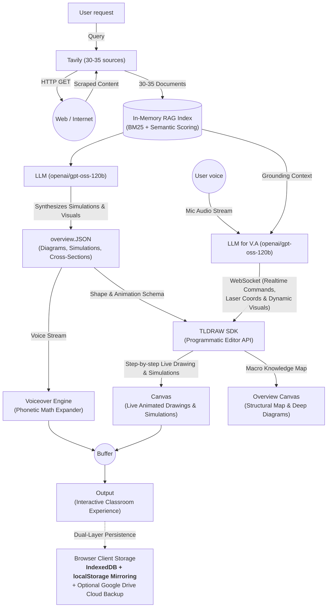
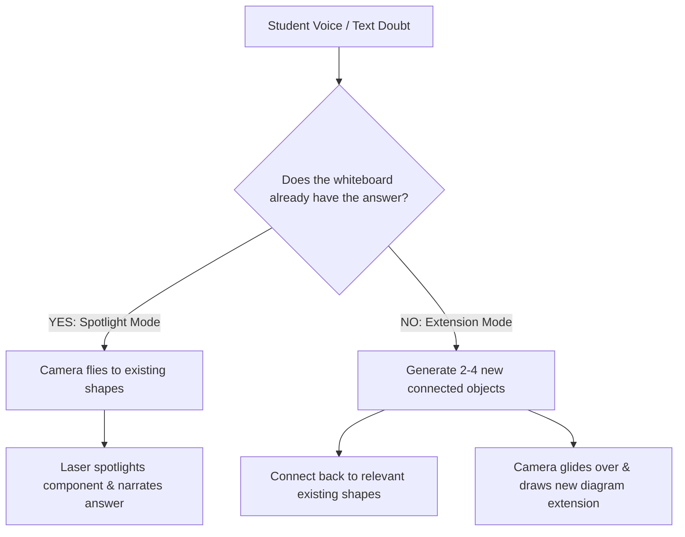

<p align="center">
  
</p>

<h1 align="center">Chalkie: The Visual-First AI Whiteboard Teacher</h1>

<p align="center">
  <strong>An intelligent, multimodal AI teacher that researches topics, synthesizes structured semantic diagrams, and delivers live, narrated visual lessons on an infinite whiteboard with synchronized voice, dynamic camera work, and a glowing laser pointer.</strong>
</p>

<p align="center">
  
  
  
  
  
  
  
</p>

---

## 💡 The Big Idea: Why Chalkie?

### The "Offline Teacher" Vibes vs. Heavy Video / PDF Generators

Most AI educational tools on the internet (like NotebookLM, slide generators, or AI video creators) try to explain concepts by generating:
- **Static slide decks & PDFs:** Flat, boring bullet points that lack intuitive visual flow.
- **Pre-rendered MP4 videos:** Extremely compute-heavy to render, requiring minutes of GPU processing time or generating thousands of lines of fragile code (Python/Manim/HTML/CSS) that easily break.
- **Non-interactive media:** Once generated, you can't click into the diagram, pan around, inspect parts, or ask follow-up questions about specific components.

### 🌟 Chalkie’s Breakthrough Approach

```
Traditional AI Video Tools:   Prompt ──> Heavy GPU Video Render (Minutes / High Cost) ──> Static MP4 Video
Chalkie Whiteboard Teacher:   Prompt ──> Lightweight Semantic JSON (Seconds / Low Tokens) ──> Live Interactive Whiteboard
```

1. **Ultra-Low Token Consumption & Zero GPU Load:**
   Chalkie does **not** write thousands of lines of code or stress expensive server GPUs to render video frames. Instead, Groq Cloud’s `openai/gpt-oss-120b` generates a compact, semantic JSON schema (`overview.JSON`). The learner’s browser handles all vector rendering in real-time.
2. **Authentic "Offline Teacher" Vibes:**
   Just like a great human teacher standing at a physical chalkboard, Chalkie doesn't just dump a pre-made image on you:
   - **Step-by-step Live Sketching:** The diagram is drawn out progressively on the board as the teacher speaks.
   - **Synchronized Voiceover & Laser Pointer:** A natural, warm voice explains the concept while a live **glowing laser pointer** guides the student's eye to the exact component, layer, or subatomic particle being discussed.
   - **Cinematic Camera Tracking:** The canvas camera smoothly glides, pans, and zooms (`zoomToBounds`) to keep the learner focused on what matters right now.
3. **Infinite, Fully Interactive Canvas:**
   Because it's a real **tldraw** whiteboard, you can pan around, zoom into cutaways, and interact with the lesson.
4. **Conversational Doubts with Smart Camera Flying:**
   Have a question? Ask it with your voice. Chalkie either **flies the camera to spotlight an existing shape** on the board and explains it, or **draws a connected visual extension beside the original diagram** on the infinite canvas.

---

## 🏛️ System Architecture

Chalkie coordinates live web research, dual LLM instances, client-side vector graphics, and audio synchronization into a unified real-time classroom:



### How the Pipeline Works

1. **Web Ingestion (`Tavily 30-35` $\leftrightarrow$ `Web / Internet`):**
   Tavily scrapes 30–35 relevant web documents and markdown extracts for the question, populating a centralized session **In-Memory RAG Index** (with BM25 lexical scoring and optional vector embeddings).
2. **Dual LLM Engines (`openai/gpt-oss-120b` via Groq Cloud):**
   - **Primary Lesson Generator (`LLM`):** Synthesizes physical mechanisms, cutaways, and simulations into `overview.JSON`.
   - **Voice Assistant (`LLM for V.A`):** Ingests live microphone audio (`User voice`), grounds answers in the `RAG Index`, and sends low-latency WebSocket frames (`Realtime Commands, Laser Coords & Dynamic Visuals`).
3. **TLDRAW SDK (Programmatic Editor API):**
   Drives two synchronized canvas views:
   - **Canvas (Live Animated Drawings & Simulations):** Progressive step-by-step whiteboard drawings, scientific primitives, and laser tracking.
   - **Overview Canvas (Structural Map & Deep Diagrams):** Macro knowledge map providing high-level structural cutaways and cross-sections.
4. **Audio-Visual Synchronization Buffer:**
   The `Voiceover` engine and `Canvas` animations both feed into a synchronization **Buffer**. The next drawing step advances only when the narration finishes, ensuring 100% audio-visual alignment.
5. **Output & Dual-Layer Client Storage / Google Drive:**
   Delivers the live interactive classroom. State is stored locally in browser **IndexedDB + `localStorage`**, with individual notebook deletion and optional **Google Drive** cloud backup (`drive.file` scope).

---

## ⚡ Key Highlights

- **No Generic Boxes & Flowcharts:** Chalkie is strictly instructed never to emit boring `[Step 1] -> [Step 2]` flowcharts. It draws physical cutaways (e.g., flash memory floating gates with trapped electron particles, train bogies, Bohr atomic shells with quarks, and hydraulic chambers).
- **Mathematical Zero-Collision Layout:** Powered by **ELK.js (Eclipse Layout Kernel)** and **Dagre**, ensuring compound container hierarchy, clean margins, and spline edge routing without overlapping text.
- **WCAG 2.1 AAA Contrast Compliance:** Dynamic text inverting algorithm (`getContrastingTextColor`) automatically chooses high-contrast dark chalk ink (`#090d16`) on bright fills and pure white (`#f8fafc`) on dark fills, guaranteeing contrast ratios from **`7.35:1` to `19.43:1`**.
- **Parametric Scientific Primitives:** Built-in primitives for subatomic particles (`quarks`, `cluster`, `orbit`), waves, coils, particle fields, and coordinate `axes` with mandatory axis titles and ticks.
- **Native Recharts Charts:** Statistical and quantitative data renders as live interactive charts (`custom-chart`) inside tldraw, complete with hover tooltips and dark/light mode awareness.
- **Phonetic Speech Formatter:** Automatically expands technical units (`25 kV` $\rightarrow$ `25 kilovolts`, `3.2 GHz` $\rightarrow$ `3.2 gigahertz`), abbreviations, Unicode subscripts (`x₁` $\rightarrow$ `x 1`), and math symbols (`∂L/∂W` $\rightarrow$ `gradient of loss with respect to W`, `ŷ` $\rightarrow$ `y-hat`, `ΔW` $\rightarrow$ `delta W`) for clear, human-like narration.
- **Dual-Layer Persistence & Direct Routing:** Synchronous mirroring across `IndexedDB` and `localStorage` with direct URL routing (`/studio?id=...`). Cached lessons are automatically repaired and restored without ever getting dropped.
- **Workspace Notebook Management:** Every notebook card in **Recent visual lessons** features an instant delete button (`Trash2`), clear cache reset, and 1-click JSON backup download.
- **Google Drive Cloud Sync:** Optional 1-click cloud sync with official restricted `drive.file` scope.
- **Enterprise BYOK (Bring Your Own Key):** Supports up to 3 Groq keys and 1 Tavily key, encrypted via **AES-256-GCM in HttpOnly cookies**. The sticky pool automatically fails over on rate limits (429) or auth errors without dropping the request.
- **Offline / Free Demo Mode:** Works immediately without any credentials by loading a deterministic, interactive neural network whiteboard lesson.

---

## 🔄 Conversational Follow-Ups: Revisit vs. Append

When a learner asks a doubt during or after a lesson:



- **Revisit (`coverage: "existing"`):** If you ask *"What does the control unit do?"*, Chalkie doesn't redraw the board. The camera glides to the existing control unit shape and the laser spotlights it while Chalkie explains.
- **Append (`coverage: "append"`):** If you ask *"What about L1 cache?"*, Chalkie creates a new connected diagram extension beside the processor and smoothly guides you over to it.

---

## 📂 Project Structure

```
chalkie/
├── app/
│   ├── api/
│   │   ├── lesson/             # Streaming lesson generator (SSE)
│   │   ├── follow-up/          # Conversational doubt streaming route
│   │   ├── byok/               # AES-256-GCM encrypted provider credentials
│   │   ├── speech/             # Groq Orpheus text-to-speech route
│   │   ├── transcribe/         # Groq Whisper speech-to-text route
│   │   ├── health/             # System health & diagnostic status
│   │   ├── drive/              # Google Drive backup and restore
│   │   └── ws/                 # WebSocket gateway (laser, pointer, presence)
│   ├── studio/                 # Three-panel whiteboard classroom page
│   ├── globals.css             # Tailwind chalkboard theme styling
│   └── page.tsx                # Notebook workspace homepage
├── components/
│   ├── canvas-templates/       # Pre-built pedagogical whiteboard templates
│   ├── chalk-canvas.tsx        # tldraw canvas host with camera & laser controls
│   ├── chalk-visual-shape.tsx  # Custom tldraw shape for parametric SVG visuals
│   ├── custom-shapes.tsx       # Recharts, SVG, and template shape utilities
│   ├── chalkie-home.tsx        # Home workspace: topic input, recent lessons, delete
│   ├── chalkie-studio.tsx      # Main classroom orchestrator (panels, audio, chat)
│   ├── provider-control.tsx    # BYOK modal & quota telemetry indicators
│   └── voice-settings-dialog.tsx # Speech rate, pitch, and voice selector
├── lib/
│   ├── elk-spatial-layout.ts   # ELK.js hierarchical compound spatial engine
│   ├── tldraw-spatial-layout.ts# Dagre graph layout & bounding box math
│   ├── lesson-layout.ts        # 12-step spatial relaxation & anchor calculation
│   ├── lesson-schema.ts        # Zod schema definitions for lessons & parts
│   ├── groq.ts                 # Groq prompt templates, model calling, and rerank
│   ├── groq-pool.ts            # Sticky 3-key failover pool with quota tracking
│   ├── research.ts             # Tavily search, chunking, and in-memory hybrid RAG
│   ├── speech-formatter.ts     # Phonetic converter, unit & math symbol expander
│   ├── voice-selection.ts      # Browser voice ranking & selection algorithm
│   └── client-storage.ts       # IndexedDB & localStorage dual persistence
├── server.mjs                  # Custom Node.js HTTP + WebSocket server
└── package.json                # Dependencies and scripts
```

---

## ⚙️ Environment Variables

Create a `.env.local` file by copying `.env.example`:

```bash
cp .env.example .env.local
```

| Variable | Required | Default | Description |
| :--- | :---: | :---: | :--- |
| `GROQ_API_KEY` | **Recommended** | — | Primary Groq key for `openai/gpt-oss-120b`, Whisper, and Orpheus. |
| `GROQ_API_KEY_2` | Optional | — | Secondary failover key in the sticky Groq pool. |
| `GROQ_API_KEY_3` | Optional | — | Tertiary failover key in the sticky Groq pool. |
| `TAVILY_API_KEY` | Optional | — | Activates live web research of 30–35 sources. |
| `BYOK_ENCRYPTION_SECRET` | Production | Ephemeral | 32+ character secret for AES-256-GCM cookie encryption. |
| `NEXT_PUBLIC_TLDRAW_LICENSE_KEY` | Production | — | Required by tldraw for commercial production deployments. |
| `GOOGLE_CLIENT_ID` | Optional | — | Google Cloud OAuth Client ID for Drive backup. |
| `GOOGLE_CLIENT_SECRET` | Optional | — | Google Cloud OAuth Client Secret. |
| `SESSION_SECRET` | Optional | — | 32+ character secret for Google Drive session cookies. |
| `NEXT_PUBLIC_USE_GROQ_TTS`| Optional | `false` | Set to `true` to use Groq Orpheus TTS; otherwise uses browser speech. |

> **Credential-Free Testing:** When no keys are provided, Chalkie automatically runs in **Demo Mode**, loading a pre-built interactive neural network whiteboard lesson.

---

## 🚀 Getting Started

### Prerequisites

- **Node.js:** `>= 22.13.0`
- **Package Manager:** `npm` or `pnpm`

### 1. Clone & Install

```bash
git clone https://github.com/kushagarwal2910-lang/chalkie.git
cd chalkie
npm install
```

### 2. Run the Development Server

```bash
npm run dev
```

Open `http://localhost:3000`. Chalkie starts with its custom `server.mjs`, powering both the Next.js frontend and the active `/api/ws` WebSocket server.

---

## 🧪 Verification & Testing

```bash
# Typecheck TypeScript
npm run typecheck

# Test WCAG 2.1 AAA color contrast ratios
node scratch/test-wcag-contrast.mjs

# Test speech pronunciation & audio-visual sync
node scratch/test-contrast-and-sync.mjs

# Test dual-layer client storage & notebook deletion
node scratch/test-storage-and-sync.mjs

# Verify server health
node scratch/check-health.mjs
```

---

<p align="center">
  Crafted with precision for curious learners everywhere. 🎓
</p>
