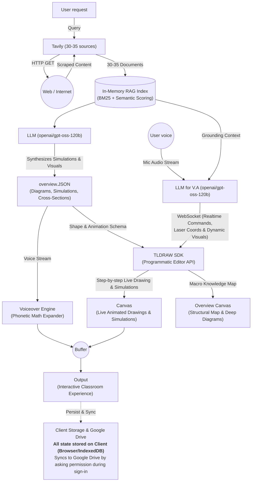
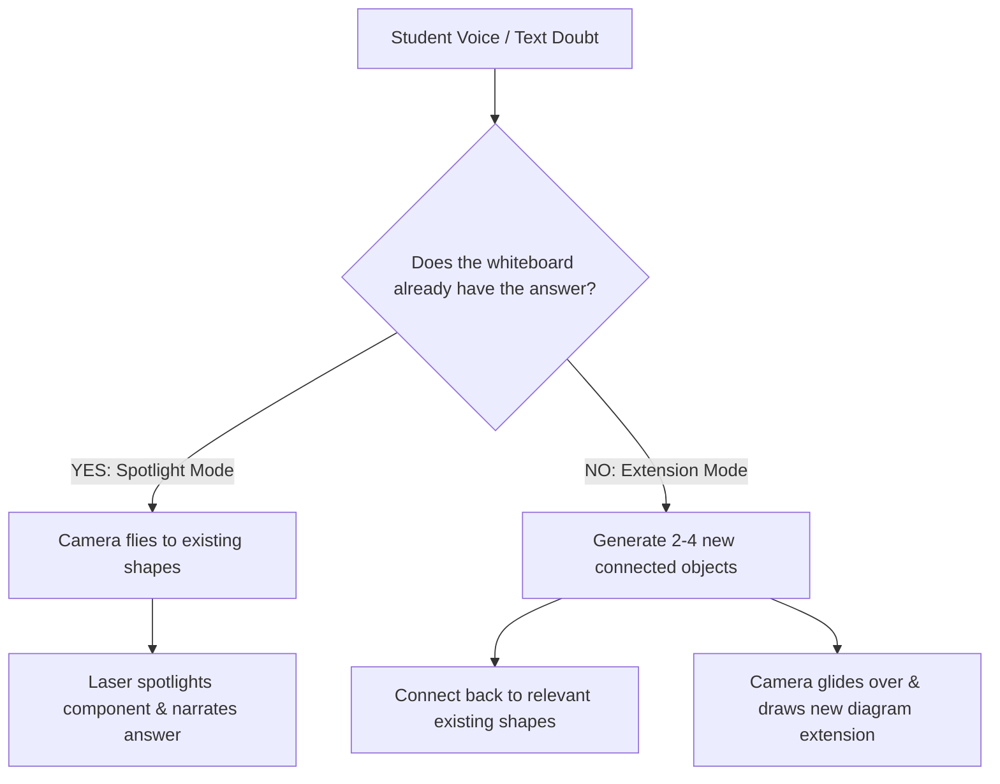

<p align="center">
  
</p>

<h1 align="center">Chalkie: The Visual-First AI Whiteboard Teacher</h1>

<p align="center">
  <strong>An intelligent, multimodal AI teacher that researches topics, synthesizes structured semantic diagrams, and delivers live, narrated visual lessons on an infinite chalkboard with synchronized voice, cinematic camera tracking, and a glowing laser pointer.</strong>
</p>

<p align="center">
  
  
  
  
  
  
  
</p>

---

## 💡 The Big Idea: Why Chalkie?

### The "Offline Teacher" Whiteboard Paradigm vs. Heavy Video / PDF Generators

Most AI educational tools on the internet (such as slide generators, generic chatbots, or AI video creators) attempt to explain concepts through:
- **Static slide decks & PDFs:** Flat, disconnected bullet points that fail to convey mechanical, structural, or spatial relationships.
- **Pre-rendered MP4 videos:** Extremely compute-heavy, requiring minutes of server-side GPU rendering, high operational cost, and fragile code generation (Python/Manim/HTML) prone to runtime crashes.
- **Non-interactive media:** Once rendered, the student cannot click components, pan the board, zoom into cross-sections, or ask contextual follow-up questions.

### 🌟 Chalkie’s Breakthrough Approach

```
Traditional AI Video Tools:   Prompt ──> Heavy GPU Video Render (Minutes / High Cost) ──> Static MP4 Video
Chalkie Whiteboard Teacher:   Prompt ──> Lightweight Semantic JSON (Seconds / Low Tokens) ──> Live Interactive Whiteboard
```

1. **Ultra-Low Token Consumption & Zero GPU Load:**
   Chalkie does **not** generate thousands of lines of fragile rendering code or stress expensive server GPUs to render video frames. Instead, Groq Cloud’s `openai/gpt-oss-120b` generates a compact, validated semantic JSON schema (`overview.JSON`). The learner’s browser renders vector graphics directly on the infinite canvas in real-time.
2. **Authentic "Offline Teacher" Classroom Experience:**
   Replicating the presence of an exceptional teacher standing at a physical chalkboard:
   - **Step-by-step Live Sketching:** Diagrams are drawn out progressively as the teacher explains each part.
   - **Synchronized Voiceover & Laser Pointer:** Natural voice explains concepts while a live **glowing laser pointer** spotlights the exact component, layer, or subatomic particle under discussion.
   - **Cinematic Camera Tracking:** The canvas camera smoothly glides, pans, and zooms (`zoomToBounds`) to keep the learner focused on what matters at that moment.
3. **Infinite, Fully Interactive Canvas:**
   Built on the production **tldraw** engine, learners can pan, zoom into cutaways, select objects, inspect diagrams, and explore at their own pace.
4. **Conversational Doubts with Smart Camera Navigation:**
   Students can ask questions via voice or text. Chalkie either **flies the camera to spotlight an existing shape** on the board and explains it, or **draws a connected visual extension beside the original diagram** on the infinite canvas.

---

### Pipeline Flowchart



### End-to-End Pipeline Breakdown

1. **Web Ingestion & Research (`Tavily` $\leftrightarrow$ `Web / Internet`):**
   - User inputs a topic or inquiry.
   - Tavily API searches and retrieves up to 20 deduplicated high-authority sources with advanced markdown scraping.
   - Sources are parsed into 30–35+ rich context chunks (up to 120 stored chunks per session).
2. **In-Memory RAG Indexing:**
   - Text chunks are indexed in an in-memory session index (`globalThis.chalkieResearchIndexes`).
   - Hybrid ranking combines BM25 lexical token matching with optional cosine semantic vector embeddings (`rankChunks`).
   - Zero token waste: research indexing does not consume Groq teaching quota.
3. **Dual LLM Engines (`openai/gpt-oss-120b` on Groq Cloud):**
   - **Primary Lesson Generator (`LLM`):** Synthesizes physical mechanisms, structural cutaways, and simulations into strict semantic schema (`overview.JSON`).
   - **Voice Assistant (`LLM for V.A`):** Ingests live microphone audio (`User voice`), transcribes speech via Groq Whisper (`whisper-large-v3-turbo`), retrieves grounding context from the session RAG index, and streams answers and whiteboard commands.
4. **TLDRAW SDK (Programmatic Editor API):**
   - Governs two synchronized canvas layers:
     - **Canvas (Live Animated Drawings & Simulations):** Progressive step-by-step whiteboard drawings, scientific primitives, and laser tracking.
     - **Overview Canvas (Structural Map & Deep Diagrams):** Macro knowledge map providing high-level structural cutaways and cross-sections.
5. **Realtime WebSocket Gateway:**
   - Relays live teacher events: `timeline`, `pointer` (laser coordinates), `interrupt`, and `voice_query` frames between client and server.
6. **Audio-Visual Synchronization Buffer:**
   - The `Voiceover` engine (phonetic math and technical unit expansion) and canvas animation steps feed into a synchronized playback buffer.
   - Step advancement is gated by narration completion, ensuring 100% audio-visual synchronization without race conditions.
7. **Client Storage & Google Drive Persistence:**
   - **Zero-Server Storage:** All lesson state, custom shapes, and notebooks are preserved client-side in browser **IndexedDB** (`chalkie-studio` / `sessions`) and mirrored to `localStorage`.
   - **Google Drive Backup:** Optional one-click backup to the learner's Google Drive via OAuth2 with restricted `drive.file` scope.

---

## ⚡ Authentically Verified Core Features

### 1. Zero-Infrastructure Architecture: Why Redis Was Safely Removed
- **No Redis Dependency:** Chalkie previously held an optional Redis layer for research chunk caching. This was removed to make Chalkie completely zero-infrastructure, eliminating external container requirements (no Upstash or local Redis instance needed).
- **Fast In-Memory Session Cache:** RAG research chunks are held in an in-memory `Map<string, ResearchIndex>` keyed by `sessionId` on the server for the duration of the lesson and follow-ups.
- **Client-First Persistence:** Whiteboard state and notebooks are stored in browser **IndexedDB + `localStorage`**. No database migrations or server storage required.

### 2. Intelligent Spatial Layout: ELK.js & Dagre
- **Zero-Collision Compound Layout:** Powered by **ELK.js (Eclipse Layout Kernel)** and **Dagre**, ensuring container hierarchy, clean margins, and spline edge routing without overlapping text.
- **12-Step Spatial Relaxation:** `lib/lesson-layout.ts` enforces strict bounding box clearance, container expansion, and connector anchor snapping.
- **Physical Cutaways over Flowcharts:** System prompts explicitly instruct the AI never to emit generic flowchart boxes. It constructs anatomical and mechanical cutaways (e.g., flash memory floating gates with trapped electron particles, hydraulic chambers, multi-layer neural networks).

### 3. Parametric Scientific Primitives & Custom Shapes
Chalkie provides a specialized suite of custom tldraw shape utilities (`chalkShapeUtils`):
- **Scientific Particles & Fields:** Dedicated parametric SVG primitives for `orbit` (Bohr atomic shells), `cluster` (nuclei, particle clouds), `quarks` (triplet subatomic structures), `wave` (sine/damped oscillations), `coil` (inductors, springs), `particles` (gas/drift flows), and `radial` fields.
- **Geometric Primitives:** `ellipse`, `rect`, `line`, `arrow`, `polyline`, `polygon`, `path`, `text`, and coordinate `axes` (with automatic tick labels and axis titles).
- **Interactive Recharts Charts (`ChartShapeUtil`):** Quantitative data renders directly on the canvas as interactive Bar, Line, or Area charts with hover tooltips and theme awareness.
- **Pedagogical Canvas Templates (`TemplateShapeUtil`):** Pre-built templates for `hero-breakdown`, `comparison-grid`, `layered-stack`, `network-graph`, `process-cycle`, and `timeline`.

### 4. WCAG 2.1 AAA Contrast Compliance
- **Dynamic Text Inverting Algorithm:** `getContrastingTextColor` analyzes background fill luminance and automatically assigns high-contrast dark chalk ink (`#090d16`) on bright fills and pure white (`#f8fafc`) on dark fills.
- **Verified Contrast Ratios:** All canvas element text achieves contrast ratios between **`7.35:1` and `19.43:1`**, exceeding the WCAG AAA threshold of `7.0:1`.

### 5. Phonetic Speech Formatter
- **Mathematical & Technical Expansion:** `lib/speech-formatter.ts` transforms complex notations into phonetically speakable words:
  - Technical units: `25 kV` $\rightarrow$ `25 kilovolts`, `3.2 GHz` $\rightarrow$ `3.2 gigahertz`, `500 nm` $\rightarrow$ `500 nanometers`.
  - Math symbols: `∂L/∂W` $\rightarrow$ `gradient of loss with respect to W`, `ŷ` $\rightarrow$ `y-hat`, `ΔW` $\rightarrow$ `delta W`, `½` $\rightarrow$ `one-half`.
  - Subscripts: `x₁`, `h₂` $\rightarrow$ `x 1`, `h 2`.
- **Dual Voice Providers:** Defaults to the browser's native Web Speech API with smart voice quality ranking; optionally switches to Groq Orpheus (`canopylabs/orpheus-v1-english`) via `/api/speech`.

### 6. Conversational Follow-Ups: Spotlight vs. Append
When a student asks a doubt during or after a lesson:



- **Spotlight Mode (`coverage: "existing"`):** If the concept is already present on the canvas, the camera smoothly glides to the existing shape and the glowing laser pointer spotlights it while explaining.
- **Whiteboard Extension Mode (`coverage: "append"`):** If the doubt introduces new concepts, Chalkie generates 2–4 connected shapes, places them adjacent to relevant nodes with collision clearance, and guides the learner to the new visual module.

### 7. Multi-Key BYOK Failover Pool
- **Sticky 3-Key Failover:** Configurable via `.env.local` or BYOK modal (`GROQ_API_KEY`, `GROQ_API_KEY_2`, `GROQ_API_KEY_3`).
- **Quota Tracking & Auto-Failover:** If an active key encounters rate limits (HTTP 429) or authentication errors, the pool instantly switches to the next healthy key without interrupting the generation.
- **AES-256-GCM Cookie Encryption:** User-supplied BYOK keys are encrypted with authenticated AES-256-GCM and stored in secure HttpOnly cookies (`/api/byok`).

### 8. Zero-Credential Demo Mode
- If no API keys are configured, Chalkie automatically runs in **Demo Mode**, loading a fully interactive, deterministic multi-layer Neural Network lesson with forward inference, loss calculation, backpropagation formulas, animated weights, and voiceover.

---

## 📂 Project Structure

```
chalkie/
├── app/
│   ├── api/
│   │   ├── auth/google/        # Google OAuth2 start & callback for Drive sync
│   │   │   ├── callback/route.ts
│   │   │   └── start/route.ts
│   │   ├── byok/route.ts       # AES-256-GCM encrypted provider credentials
│   │   ├── drive/save/route.ts # Google Drive notebook JSON backup (drive.file scope)
│   │   ├── follow-up/route.ts  # Conversational doubt & whiteboard extension generator
│   │   ├── health/route.ts     # Health check & provider telemetry status
│   │   ├── lesson/route.ts     # Streaming SSE lesson generator
│   │   ├── reset/route.ts      # Session & BYOK cookie reset endpoint
│   │   ├── speech/route.ts     # Groq Orpheus text-to-speech route
│   │   ├── transcribe/route.ts # Groq Whisper speech-to-text route
│   │   └── ws/route.ts         # Vercel function edge WebSocket gateway
│   ├── studio/page.tsx         # Three-panel whiteboard classroom page
│   ├── globals.css             # Tailwind chalkboard styling & design tokens
│   ├── layout.tsx              # Root HTML & theme provider layout
│   └── page.tsx                # Notebook workspace homepage
├── components/
│   ├── canvas-templates/       # Pedagogical whiteboard templates (comparison, process, etc.)
│   ├── chalk-canvas.tsx        # tldraw canvas host with camera & laser controls
│   ├── chalk-visual-shape.tsx  # Custom tldraw shape for parametric SVG & scientific visuals
│   ├── chalkie-home.tsx        # Home workspace: topic input, recent notebooks, delete
│   ├── chalkie-icon.tsx        # SVG chalkboard icon component
│   ├── chalkie-studio.tsx      # Main classroom orchestrator (panels, audio sync, chat)
│   ├── custom-shapes.tsx       # Recharts, SVG container, and template shape utilities
│   ├── provider-control.tsx    # BYOK modal & quota telemetry indicators
│   ├── ui/                     # UI components (buttons, dialogs, dropdowns, inputs)
│   └── voice-settings-dialog.tsx # Speech rate, pitch, and voice selector dialog
├── lib/
│   ├── client-storage.ts       # IndexedDB & localStorage dual persistence engine
│   ├── demo-lesson.ts          # Deterministic offline Neural Network lesson
│   ├── drive-session.ts        # Google Drive session cookie encryption & verification
│   ├── elk-spatial-layout.ts   # ELK.js hierarchical compound spatial engine
│   ├── follow-up.ts            # Follow-up schema repair and layout appending
│   ├── groq-pool.ts            # Sticky 3-key failover pool with quota tracking
│   ├── groq.ts                 # Groq prompt templates, model calling, and reranking
│   ├── lesson-layout.ts        # 12-step spatial relaxation & anchor calculation
│   ├── lesson-schema.ts        # Zod schemas for lessons, shapes, parts, and segments
│   ├── provider-credentials.ts # Key resolution (environment vs. encrypted BYOK cookies)
│   ├── realtime-hub.ts         # In-memory WebSocket presence and event relay hub
│   ├── research.ts             # Tavily search, chunking, and in-memory hybrid RAG
│   ├── speech-formatter.ts     # Phonetic converter, unit & math symbol expander
│   ├── tldraw-spatial-layout.ts# Dagre graph layout & bounding box collision math
│   ├── utils.ts                # Tailwind CSS class merge utilities
│   └── voice-selection.ts      # Browser voice ranking & selection algorithm
├── public/
│   ├── architecture.png        # Validated system architecture diagram
│   ├── chalkie-icon.png        # Chalkie brand icon
│   └── favicon.svg             # Chalkie chalkboard favicon
├── scratch/                    # Verification & automated test scripts
├── server.mjs                  # Custom Node.js HTTP + WebSocket server
├── next.config.ts              # Next.js configuration
├── package.json                # Dependencies and project scripts
└── tsconfig.json               # TypeScript configuration
```

---

## ⚙️ Environment Variables

Create a `.env.local` file by copying `.env.example`:

```bash
cp .env.example .env.local
```

| Variable | Required | Default | Description |
| :--- | :---: | :---: | :--- |
| `GROQ_API_KEY` | **Recommended** | — | Primary Groq key for `openai/gpt-oss-120b`, Whisper, and Orpheus. |
| `GROQ_API_KEY_2` | Optional | — | Secondary failover key in the sticky Groq pool. |
| `GROQ_API_KEY_3` | Optional | — | Tertiary failover key in the sticky Groq pool. |
| `TAVILY_API_KEY` | **Recommended** | — | Activates live web research of 30–35 sources. |
| `BYOK_ENCRYPTION_SECRET` | Production | Ephemeral | 32+ character random secret for AES-256-GCM cookie encryption. |
| `NEXT_PUBLIC_TLDRAW_LICENSE_KEY` | Production | — | Required by tldraw for commercial production deployments. |
| `GOOGLE_CLIENT_ID` | Optional | — | Google Cloud OAuth Client ID for Google Drive cloud sync. |
| `GOOGLE_CLIENT_SECRET` | Optional | — | Google Cloud OAuth Client Secret. |
| `SESSION_SECRET` | Optional | — | 32+ character random secret for Google Drive session cookies. |
| `NEXT_PUBLIC_USE_GROQ_TTS`| Optional | `false` | Set to `true` to use Groq Orpheus TTS; otherwise uses browser speech. |
| `GROQ_STT_MODEL` | Optional | `whisper-large-v3-turbo` | Groq Speech-to-Text model override. |
| `GROQ_TTS_MODEL` | Optional | `canopylabs/orpheus-v1-english` | Groq Text-to-Speech model override. |
| `EMBEDDING_BASE_URL` | Optional | — | Optional OpenAI-compatible embedding provider endpoint. |
| `EMBEDDING_API_KEY` | Optional | — | Optional embedding provider API key. |
| `EMBEDDING_MODEL` | Optional | — | Optional embedding model name. |

> **Credential-Free Testing:** When no API keys are provided, Chalkie automatically runs in **Demo Mode**, loading a pre-built interactive Neural Network whiteboard lesson.

---

## 🚀 Getting Started

### Prerequisites

- **Node.js:** `>= 22.13.0`
- **Package Manager:** `npm` or `pnpm`

### 1. Clone & Install

```bash
git clone https://github.com/kushagarwal2910-lang/chalkie.git
cd chalkie
npm install
```

### 2. Configure Environment

```bash
cp .env.example .env.local
# Add your GROQ_API_KEY and TAVILY_API_KEY (optional for demo mode)
```

### 3. Run the Development Server

```bash
npm run dev
```

Open `http://localhost:3000`. Chalkie starts using its custom `server.mjs`, powering both the Next.js App Router frontend and the active `/api/ws` WebSocket server.

---

## 🧪 Verification & Testing

For Render production deployments, set `NEXT_PUBLIC_TLDRAW_LICENSE_KEY` in the
service's Environment settings **before building**, then choose **Save, rebuild,
and deploy**. Next.js embeds public variables in its browser bundles, so restarting
an existing build does not install a new key. Docker builds accept this variable as
a build argument. The SDK needs an active key covering the deployed hostname;
localhost can work without one even when production will not. See the
[tldraw license setup](https://tldraw.dev/sdk-features/license-key).

Playback waits for the requested canvas scene to finish layout and paint. New
visuals become visible on the actual voice start event. Device voices use word
boundaries for cursor timing when supported, with rate-aware estimates otherwise.
Recorded TTS uses its actual media clock and duration; without word timestamps,
individual word positions in that recording are approximate. If the SDK removes
the editor because a license is missing or expired, Chalkie stops narration and
shows a whiteboard error.

Chalkie includes automated verification test scripts in `scratch/`:

```bash
# Typecheck TypeScript codebase
npm run typecheck

# Regression checks for delayed canvas loading, speech timing, buffering, and cancellation
node --experimental-strip-types --test scratch/test-playback-sync.mjs

# Verify WCAG 2.1 AAA color contrast ratios across all chalk fills
node scratch/test-wcag-contrast.mjs

# Verify phonetic math speech formatting & audio-visual alignment
node scratch/test-contrast-and-sync.mjs

# Verify dual-layer IndexedDB/localStorage persistence & notebook deletion
node scratch/test-storage-and-sync.mjs

# Verify server health and provider status
node scratch/check-health.mjs
```

---

<p align="center">
  Crafted with precision for curious learners everywhere. 🎓
</p>
